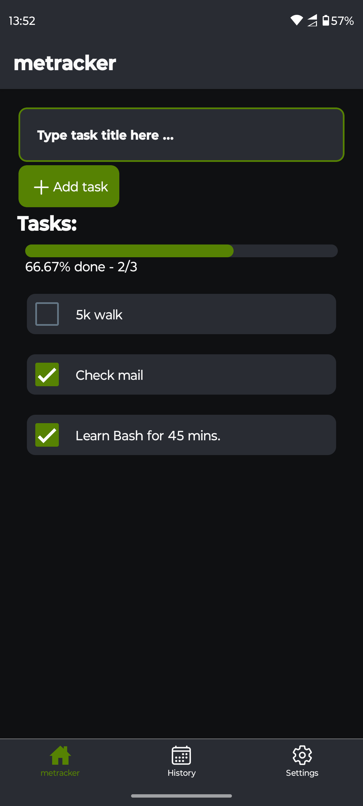
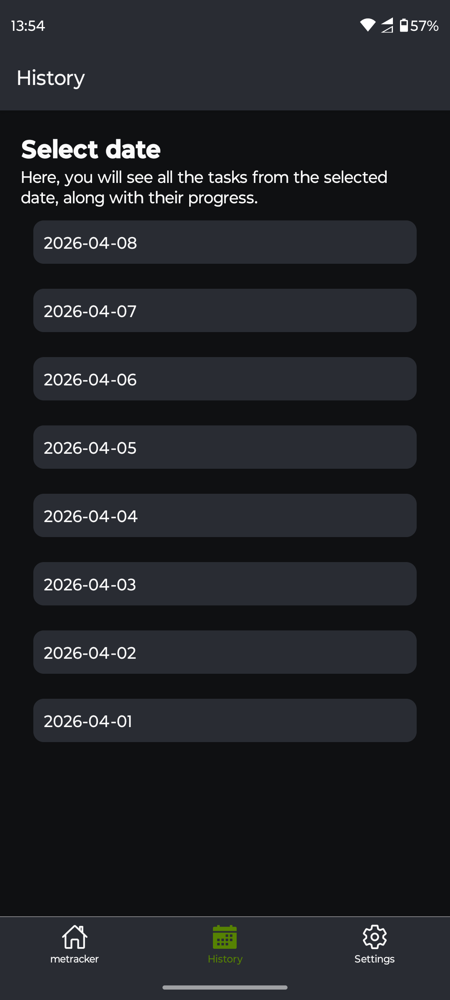
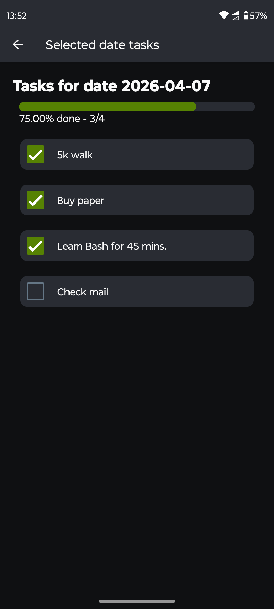
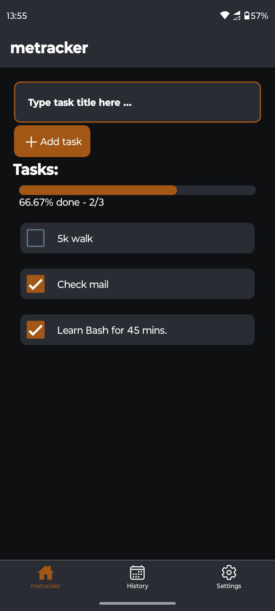

# Metracker 

A simple app for daily to-dos created with React Native Expo. The app is very simple, I built it for myself to track my daily tasks. When the app is launched for the first time on a given day, tasks from the previous day are copied and marked as unfinished.


<div style="display: flex; gap: 10px;">
  
  
  
  
</div>


## How to run/develop the application

Install NodeJS on your system  and then download dependencies:
```bash
npm install
```

Start a development server to work on your project by running:
```bash
npx expo start
```
Then, in the terminal, steps on how to run the app in Expo Go will appear.


## Create .apk locally


As a prerequisite for these steps, you must install Android Studio and Java. You also need to install the Android SDK and set the environment variables:   
- ***ANDROID_HOME*** for the Android SDK and 
- ***JAVA_HOME*** for the Java JDK.


Generate android folder and all needed configs and scripts for apk building:
```bash
npx expo prebuild
```


Command to create arm64 .apk:
```bash
cd ./android 
./gradlew assembleRelease -PreactNativeArchitectures=arm64-v8a
```

